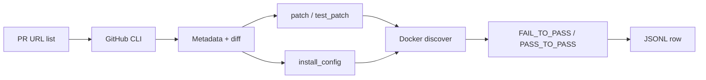

# PR → SWE-rebench JSONL

Convert **GitHub pull request URLs** into **JSONL training/evaluation tasks** compatible with the [SWE-rebench](https://huggingface.co/datasets/nebius/SWE-rebench) format.

Each output line is one task: a real bugfix PR packaged with patches, problem text, install instructions, and (optionally) which tests fail before the fix and pass after.

---

## What this tool does

Given a text file of PR links (one per line), the pipeline:

1. **Fetches PR metadata** via the GitHub CLI (`gh`) — title, body, base commit, linked issues, comments.
2. **Splits the PR diff** into:
  - `patch` — production/source changes
  - `test_patch` — test-only changes (heuristics + optional LLM)
3. **Builds an install recipe** (`install_config`) — CI/workflows + manifests + language heuristics, optional LLM refine, per-repo cache (`~/.cache/swe_rebench_pr/install_config` or `SWE_REBENCH_INSTALL_CACHE`).
4. **Runs tests in Docker** (default) — clones the repo at `base_commit`, installs, runs tests, applies patches, runs again, and fills `FAIL_TO_PASS` / `PASS_TO_PASS`.
5. **Writes one JSON object per line** to your output file — only rows that pass quality checks (`task_type` is `valid` or `partially_valid`).

Use cases:

- Build SWE-bench-style datasets from curated PR lists
- Prototype agent benchmarks from real merged fixes
- Export install + test metadata for harness development

This is a **local, single-machine pipeline**. It is not a full replica of Nebius’s production TractoAI / cluster tooling (see [Limitations](#limitations)).

---

## Quick start

### 1. Prerequisites


| Requirement                                    | Purpose                                                              |
| ---------------------------------------------- | -------------------------------------------------------------------- |
| **Python 3.10+**                               | Runs the tool                                                        |
| **[GitHub CLI `gh](https://cli.github.com/)`** | Fetch PR/issue data (`gh auth login`)                                |
| **Docker**                                     | Default test discovery (or use `--no-discover-tests-docker`)         |
| **LLM API key**                                | Recommended for patch split, install recipes, and Docker remediation |


### 2. Install

```bash
cd swe-bench-taskgen
pip install -e .
```

Docker discovery also needs: `docker`, `requests`, `unidiff` (included in `pyproject.toml` dependencies).

### 3. Configure API access

**Never commit API keys.** Use environment variables only.

When run via the **swe-bench-taskgen** monorepo (`./run_pipeline.sh`), set `TASKGEN_*` keys in the root `.env` (see monorepo `README.md`). The tool loads that file automatically.

Standalone / manual runs:

```bash
# Default: Anthropic (model claude-opus-4-6)
export ANTHROPIC_API_KEY=your_key_here

export GITHUB_TOKEN=your_token_here
# Or OpenAI-compatible API:
# export OPENAI_API_KEY=...
# export OPENAI_BASE_URL=https://api.openai.com/v1
# export OPENAI_MODEL=...
```

Monorepo `.env` equivalents: `TASKGEN_ANTHROPIC_API_KEY`, `TASKGEN_OPENAI_API_KEY`, `TASKGEN_LLM_MODEL`, `TASKGEN_OPENAI_BASE_URL`.

Optional overrides: `LLM_MODEL`, `ANTHROPIC_MESSAGES_MODEL_ID`.

### 4. Run

Create a URL list (see `example_pr_urls.txt`):

```text
# One URL per line; lines starting with # are ignored
https://github.com/owner/repo/pull/123
```

Generate tasks:

```bash
python3 -m swe_rebench_pr \
  --urls example_pr_urls.txt \
  -o output/tasks.jsonl
```

Progress and skips are logged to **stderr**; successful rows go to the **output JSONL file**.

---

## How the pipeline works




**Docker discovery** (default):

1. Build or reuse bundled **harness images** (`swe_rebench_pr/harness/`).
2. Clone the repo at `base_commit` inside a container.
3. Run `install_config` scripts.
4. Run tests → record baseline (JUnit/pytest/Cargo/etc. depending on language).
5. `git apply` `patch` + `test_patch`, run tests again.
6. Compute which tests **fail at base** and **pass after patch** → `FAIL_TO_PASS`, `PASS_TO_PASS`.

If install fails, patches do not apply, or no failing-to-passing tests are found, the row is **skipped** (not written). An LLM may retry install recipes or fix `test_patch` across several rounds.

**Without Docker** (`--no-discover-tests-docker`): you still get metadata, patches, and `install_config`, but `FAIL_TO_PASS` / `PASS_TO_PASS` stay `[]` and `task_type` is not graded.

---

## Output format

**JSONL**: one JSON object per line, **17 fields** in a fixed order (SWE-rebench-aligned, plus `language`).


| Field                      | Description                                                                         |
| -------------------------- | ----------------------------------------------------------------------------------- |
| `instance_id`              | `owner__repo-<pr_number>`                                                           |
| `patch`                    | Unified diff hunks for **non-test** files                                           |
| `repo`                     | `owner/name`                                                                        |
| `base_commit`              | Base branch SHA when the PR was opened                                              |
| `hints_text`               | Issue comments before the PR’s first commit (from linked closing issue), or `""`    |
| `created_at`               | PR creation timestamp                                                               |
| `test_patch`               | Unified diff hunks for **test** files only                                          |
| `problem_statement`        | Linked issue title+body, or PR title+body                                           |
| `version`                  | `major.minor` from git tags, or `0.0-<sha8>`                                        |
| `environment_setup_commit` | Same as `base_commit` in this single-PR pipeline                                    |
| `FAIL_TO_PASS`             | JSON **string** of test IDs that fail before patch and pass after                   |
| `PASS_TO_PASS`             | JSON **string** of tests that pass in both runs                                     |
| `task_type`                | `valid` or `partially_valid` (see below)                                            |
| `language`                 | `python`, `javascript`, `java`, `go`, `rust`, `ruby`, `php`, `c`, or detected value |
| `install_config`           | JSON **object**: install/test commands for Docker                                   |
| `requirements`             | `pip freeze` after successful install (often filled inside Docker)                  |
| `environment`              | Reserved for conda export; currently `""`                                           |


### Task types


| `task_type`       | Meaning                                                                              |
| ----------------- | ------------------------------------------------------------------------------------ |
| `valid`           | Non-empty `FAIL_TO_PASS`; test slice clean; no LLM-created `test_patch`              |
| `partially_valid` | Same, but `test_patch` was created or edited by LLM (`PASS_TO_PASS` is `[]`)         |
| *(not written)*   | Empty `FAIL_TO_PASS`, tests still failing after remediation, or install/apply failed |


---

## Command reference

### Main generation

```bash
python3 -m swe_rebench_pr --urls PRS.txt -o output/tasks.jsonl
```

Equivalent after `pip install -e .`:

```bash
pr-to-swe-rebench-jsonl --urls PRS.txt -o output/tasks.jsonl
```

### Common options


| Flag                             | Effect                                                                                |
| -------------------------------- | ------------------------------------------------------------------------------------- |
| `--language LANG`                | `python`, `javascript`, `java`, `go`, `rust`, `ruby`, `php`, `c`, or `auto` (default) |
| `--no-discover-tests-docker`     | Skip Docker; leave test lists empty                                                   |
| `--no-llm-patch-split`           | Heuristic-only patch vs test split                                                    |
| `--no-llm-install`               | Minimal heuristic `install_config`                                                    |
| `--no-docker-llm-remediation`    | No LLM retries when Docker install/tests fail                                         |
| `--force-rebuild-harness-images` | Rebuild Docker harness images                                                         |
| `--build-instance-images`        | Per-task instance images (slower legacy mode)                                         |
| `--docker-timeout SECS`          | Wall clock per discover run (default `7200`)                                          |
| `--clone-timeout SECS`           | `git clone` timeout (default `600`)                                                   |
| `--prefilter`                    | Skip PRs that fail cheap checks before Docker                                         |
| `--allow-llm-test-patch`         | Prefilter: allow PRs with no test files in diff                                       |
| `--run-install-freeze`           | Run `pip freeze` on host after install recipe (Linux best)                            |


### Preflight (check URLs without building tasks)

```bash
python3 -m swe_rebench_pr \
  --urls example_pr_urls.txt \
  --preflight-only report.txt
```

### Repair existing JSONL

Rewrites rows for SWE-bench alignment (no PR fetch, no Docker):

```bash
python3 -m swe_rebench_pr \
  --repair-jsonl output/tasks.jsonl \
  -o output/tasks_repaired.jsonl
```

---

## Supported languages

Set `--language` or use `auto` to detect from paths and repo markers.


| Language      | Test runners (examples)                                 |
| ------------- | ------------------------------------------------------- |
| Python        | pytest, Django `runtests`                               |
| JavaScript    | Jest, Vitest, Mocha (auto-detected from `package.json`) |
| Java          | Gradle / JUnit                                          |
| Go, Rust, PHP | Language-native two-phase discover (base+tests → patch) |
| Ruby, C       | Bundled Dockerfile templates                            |


Per-repo tweaks: `repo_overrides.yaml` (merged at runtime).

---

## LLM prompts

Templates live in `prompts/`:


| File                             | Role                                       |
| -------------------------------- | ------------------------------------------ |
| `list_install_files.txt`         | Pick install-related paths in the repo     |
| `extract_install_recipe.txt`     | Build `install_config` JSON (legacy Python) |
| `refine_install_recipe.txt`      | Refine CI/heuristic draft (all languages)  |
| `fix_install_recipe.txt`         | Repair install from failure logs           |
| `fix_install_from_tests.txt`     | Install fixes from test output (+ CI ctx)  |
| `create_test_patch_from_pr.txt`  | Generate `test_patch` when PR has no tests |
| `fix_test_patch_from_tests.txt`  | Fix failing test patch                     |
| `fix_test_patch_apply_check.txt` | Fix patch that fails `git apply --check`   |
| `docker_remediation.txt`         | Retry Docker environment                   |
| `resolve_gradle_test_paths.txt`  | Java Gradle test path resolution           |


Patch vs test splitting uses the same OpenAI-compatible chat JSON pattern as other SWE-bench task generators.

---

## Environment variables


| Variable                     | Purpose                                                         |
| ---------------------------- | --------------------------------------------------------------- |
| `ANTHROPIC_API_KEY`          | Default LLM provider                                            |
| `OPENAI_API_KEY`             | OpenAI-compatible provider                                      |
| `OPENAI_BASE_URL`            | API base (OpenAI routes only)                                   |
| `OPENAI_MODEL` / `LLM_MODEL` | Model name override                                             |
| `SWEBENCH_PATH`              | Optional path to full SWE-bench checkout (alignment helpers)    |
| `SWEBENCH_POST_CLONE_SH`     | Shell snippet run in container after clone (e.g. pandas tweaks) |


---

## Project layout

```
swe-bench-taskgen/
  README.md                 # This file
  pyproject.toml            # Package metadata and dependencies
  example_pr_urls.txt       # Sample input
  repo_overrides.yaml       # Per-repo discovery tweaks
  prompts/                  # LLM prompt templates
  output/                   # Example generated JSONL (not required)
  swe_rebench_pr/           # Main package
    cli.py                  # Entry point and argument parsing
    builder.py              # Assemble one task row
    gh_pr.py                # GitHub PR fetching
    diff_split.py           # patch vs test_patch
    install_llm.py          # Install recipe generation
    docker_discover.py      # Docker test discovery
    harness/                # Docker images and test runners
  tests/                    # Unit tests (pytest)
```

---

## Development

Run tests:

```bash
pip install -e ".[dev]"
pytest
```

---

## Limitations

- **Not** Nebius production infrastructure (Buildah clusters, internal mirrors, QA models).
- Docker uses `**python:X.Y-bookworm`** + your `install_config`, not prebuilt public `swerebench/*` Hub images.
- LLM recipes may suggest packages that are stripped for Docker (e.g. PyQt without Qt).
- `--run-install-freeze` skips `apt-get` pre-install steps on **macOS**.
- Default discovery clones the repo twice under temp; large repos are slow — increase `--docker-timeout` / `--clone-timeout`.
- Revoke and rotate any API key that was exposed in logs, screenshots, or chat.

---

## License

MIT — reuse prompts and code freely. Respect upstream repository licenses for mined pull requests.
